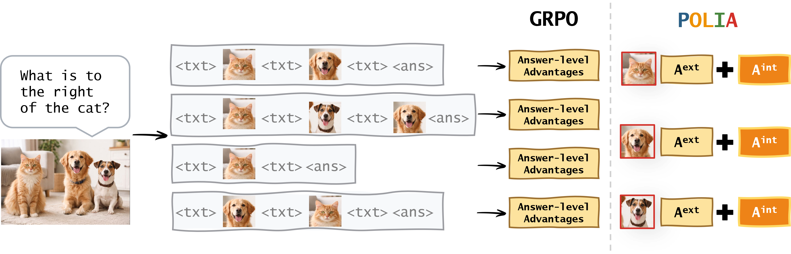

# POLIA

## Project Overview

This repository provides an implementation of **POLIA**, a policy optimization method for multimodal reasoning.

The repository contains only the core components of the training framework.

## Core Files

- **POLIA.py**: Main training script
- **POLIAtrainer.py**: Trainer implementation
- **callGPT.py**: Interface for external API calls
- **rewards.py**: Reward function implementations
- **vision_process.py**: Visual information processing utilities
- **relationReasoningDataset.py**: Dataset processing utilities
- **setup.sh**: Auxiliary setup script

## Data

All images used in the experiments are sourced from publicly available datasets referenced in the paper and follow the original dataset licenses.

## Notes

- This repository is intentionally minimal and includes only core code components.
- Experimental setup, data preparation, and infrastructure configuration are handled externally.
